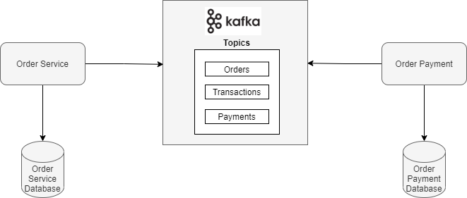

### Este exemplo foi implementado utilizando as seguinte tecnologias:
- Spring Cloud Stream e Apache Kafka Binder
- Reactive Spring
- Utilização de programação reativa para retornar o `Flux` a partir da API JDBC bloqueante.

### Arquitetura do Sistema

<p>
    
</p>


#### Para execução do docker compose
```
docker-compose up
```

### Topics
- Existem 3 tópicos que são utilizados pelo microsserviço de Order e Payment
```
- orders
- payments
- transactions
```

#### Execução
- Execute o microsserviço Order e Payment 
- Faça um POST Request na URL `localhost:9192/orders/create` com o corpo do request: 
```
{
    "userId": 1,
    "productId": 1
}
```
- Faça um GET Request para a URL `localhost:9192/orders/all` e veja o status do pedido atualizado.

#### Fluxo dos dados
- O microsserviço Order aceita uma `Order` como uma solicitação,
e este cria e envia um `OrderPurchaseEvent` para o tópico do Kafka `orders` que é processado pelo método `OrderPurchaseEventHandler` no microsserviço Payment.

- O método `OrderPurchaseEventHandler` do Microsserviço Payment processa o evento e calcula se o usuário possui crédito suficiente para aquele determinado pedido. É setado o status para `APPROVED`, caso contrário, `DECLINED`.

- O evento `PaymentEvent` é enviado para o tópico Kafka `payments` através do  método `PaymentEventHandler` do microserviço Payment.

- Se o status do método `PaymentEvent` for `APPROVED`, ele salva a transação no `TransactionRepository`. Um evento `TransactionEvent` é enviado para o tópico `transactions`.

- O método `TransactionEventConsumer` do microsserviço Order recebe as informações, se for bem-sucedido, o `OrderRepository` salva isso como `ORDER_COMPLETED`, senão `ORDER_FAILED`